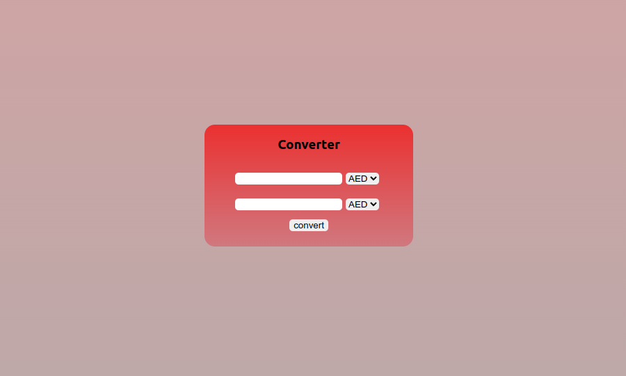
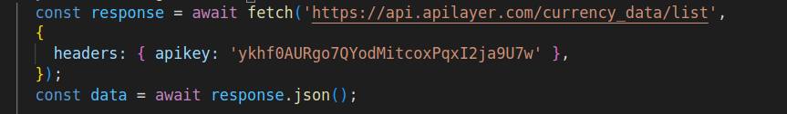

# Конвертер валюты

***Тестовое задание***

Простой и удобный конвертер валюты.

Для запуска наберите команду `npm start` или можете перейти на его страницу [https://currconverte.com](https://currconverte.herokuapp.com)

Если у вас бесконечно крутится доллар, значит запросы на бесплатном аккаунте кончились. Вы можете перейти на [сайт API](https://currencylayer.com/) чтобы создать свой API_Key и вставить в заговок запроса, вместо моего `apikey`. Обратите внимание что поменять ключ необходимо в двух запросах.

